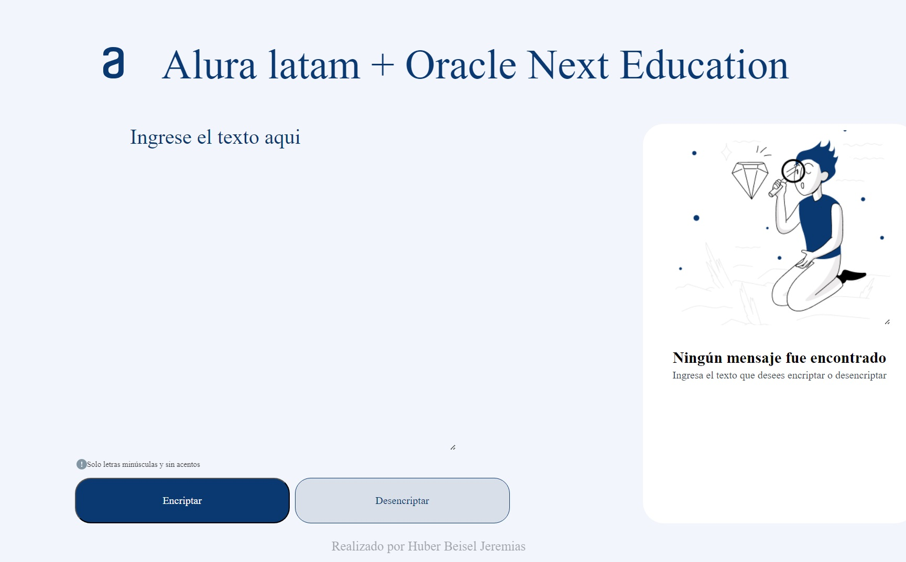
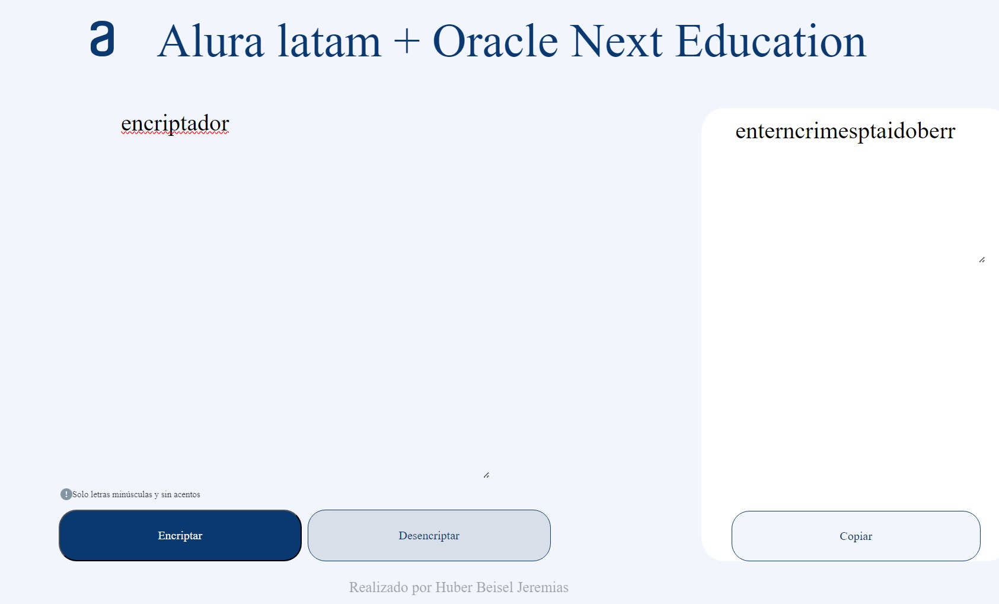
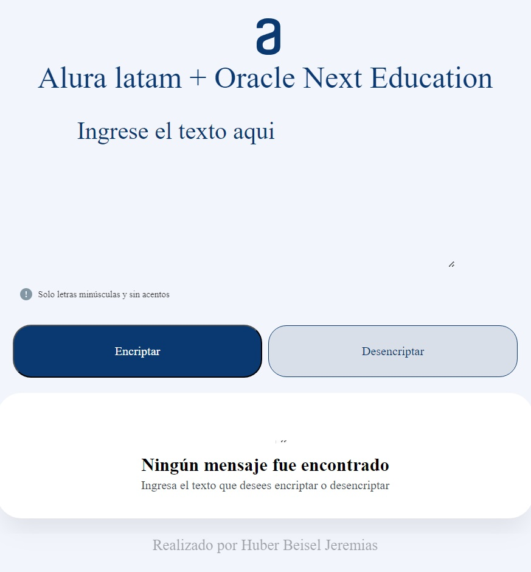
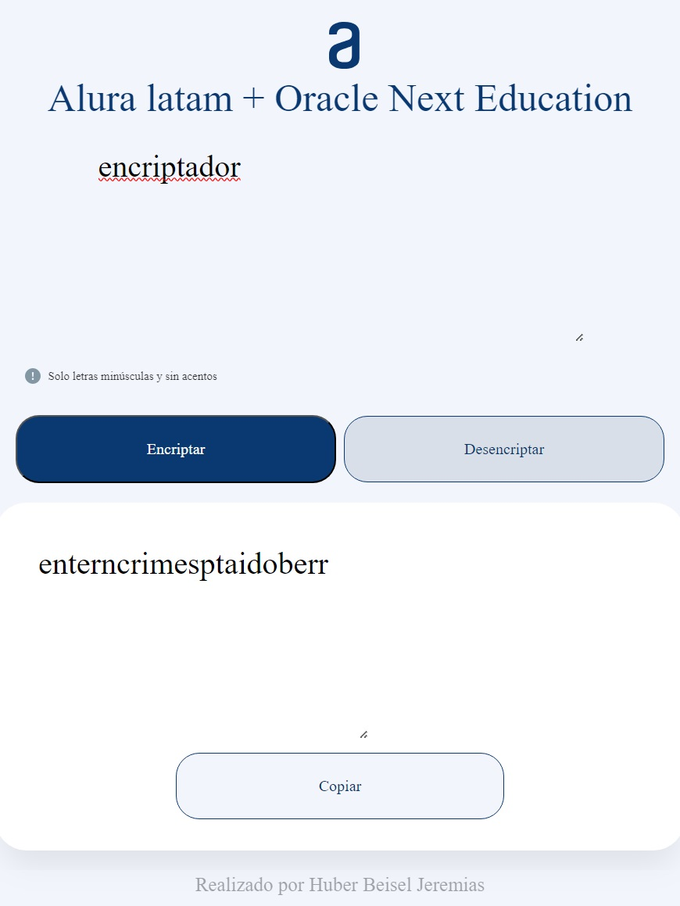
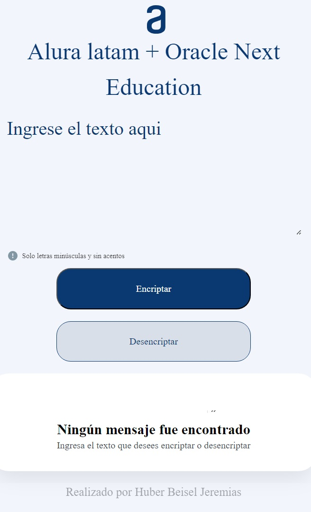
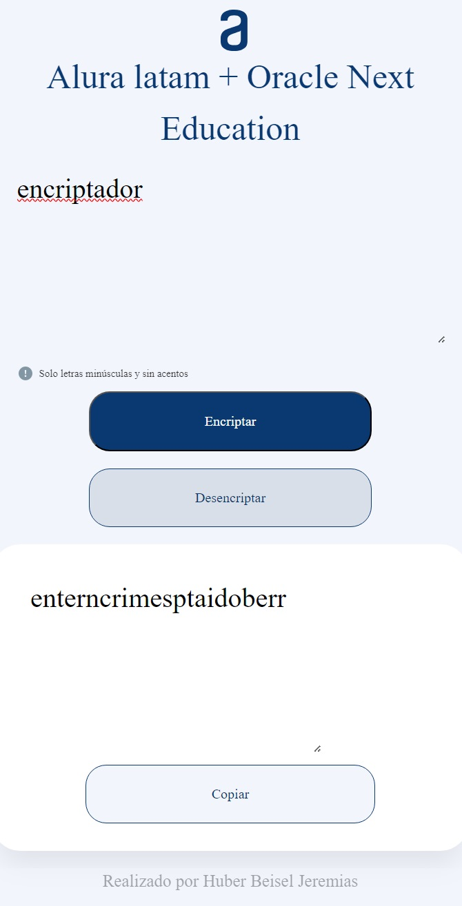

# Proyecto Encriptador - Alura Latam - ONE
Sprint 01: Desarrollo de un encriptador usando HTML, CSS y JavaScript

    #challengeonedecodificador6 #AluraLatam #ONE

## Pueba mi versión tu mismo!
[Visita la gitpage del proyecto](https://jere2023.github.io/proyecto-encriptador-alura/)
 
## Descripción del Proyecto

Desarrollar un encriptador usando HTML, CSS y JavaScript. Debe cumplir con los siguiente requicitos:
+ Debe funcionar solo con letras minúsculas
+ No deben ser utilizados letras con acentos ni caracteres especiales
+ Debe ser posible convertir una palabra para la versión encriptada también devolver una palabra encriptada para su versión original.
+ Debe usar las siguientes "llaves" de incriptación:
    + La letra "e" es convertida para "enter"
    + La letra "i" es convertida para "imes"
    + La letra "a" es convertida para "ai"
    + La letra "o" es convertida para "ober"
    + La letra "u" es convertida para "ufat"

## Visualización del Proyecto
Este diseño es compatible con pantallas de diversos dispositivos, como computadoras de escritorio, tabletas y dispositivos móviles.
Fue recreado desde el figma que nos aportó Aluta Latam, por lo que no es mi diseño, solo lo modifiqué un poco.

### Computadoras de escritorio

  
  
     

### Tabletas

  
  
     

### Celulares

  
  
     

## Conóceme un poco más

Hola, soy Jeremías, puedes conocer más de mi en los siguientes enlaces

- LinkedIn: [Mi Perfil de LinkedIn](www.linkedin.com/in/jeremias-huber-beisel-cv)
- GitHub: [Mi Perfil de GitHub](https://github.com/Jere2023)
